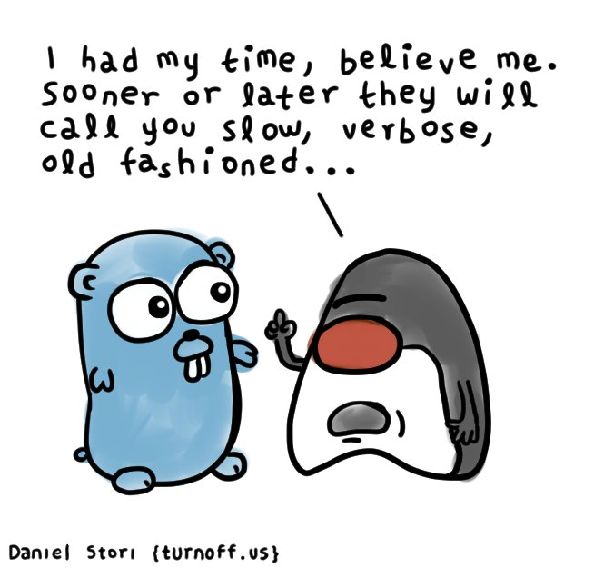

# What is it like to develop applications using Golang when you have experience with Java?

Hi everyone. In this article I would like to collect few aspects of software development with Golang from point of view of a Software Developer/Architech. I have experiance with Java since 2005 when I started to use sometimes the language for server-side application having experience already with C/C++. Few years ago I started to use Golang as well as few other languages at daily work and I would say that I definitely like the philosophy of the Golang. I cannot say that I like absolutely everything in Golang, but definitely I would use the language more. The article is not about use cases when to use Golang, but more about how to use different software development techiniques, which are used in Java (and other languages as well). What does it take to use Test Driven Development and Behavior Driven Development with Golang? In my opinion TDD and BDD are the most important approaches in software development and knowledge sharing. In this article I wanted to share my personal experience which I've got when I was making first steps in Golang few years ago. I'd started to work with a huge application written completely in Golang - it really does not matter why the application was big and monolith, sometimes we have to maintain and develop decisions especially if such a thing appears before you join a team/company.

## Test Driven Development with Golang

Of course Test Driven Development is possible with Golang and sometimes is more comfortable comparing with Java. In overall functional nature of Golang requires writing a bit less code then in Java. Quite interesting thing - Golang provides out-of-the-box testing framework as part of language. It is quite good, especially if you are fine with basic `assert___` matchers - no need to search for something special. I believe majority of Java projects are tested with usage of JUnit 4/5 as a basic testing framework, but JUnit is not part of Java :) Lets see the same function `Add` written and tested in Java and Golang.The does not do anything special - just adds one number to another and returns a result.

For example Golang:
```go
func Add(one int, two int) int {
    return one + two
}

func TestAdd(t *testing.T) {
    result := Add(1, 2)
    assert.Equal(t, 3, result)
}
```

Comparing with Java code:
```java
public class Calculator {
    public int add(int one, int two) {
        return one + two
    }
}
public class CalculatorTest {
    @Test
    public void test() {
        Calculator c = new Calculator();
        int result = c.add(1, 2);
        assertEquals(3, result);
    }    
}
```

## Mocking with Golang

The most interesting part of unit testsing is mocking. Java library `Mockito` manipulates with Java code to create mocks or a developer can derive a basic interface and few implementations from the interface where one of which can be a mock which is used in unit tests. In overall mocking in Java is something really simple and useful.

```java
public class Calculator {
    public int add(int one, int two) {
        return one + two;
    }
}
public class Numbers {
    private final Calculator c;

    public Numbers(Calculator c) {
        this.c = c;
    }

    public int makeAddition() {
        return c.add(1, 2);
    }
}

// unit test
public class NumbersTest {
    final Calculator mock = mock(Calculator.class);
    final Numbers subject = new Numbers(mock);

    @Test
    public void testMakeAddition() {
        when(mock.add(1,2)).thenReturn(3);

        int result = subject.makeAddition();

        assertEquals(3, result);
        verify(mock, times(1)).add(1,2);
    }
}

```

It is completely different in Golang - the language itself does not offer anything similar to bytecode manipulatio as Java offers OOB. Usual approach in Golang is to use interfaces and supply one implementation with business logic and another mocked.

```go
// basic interface
type Calculator interface {
	Add(one int, two int) int
}

type CalculatorImpl struct{}

func (c *CalculatorImpl) Add(one int, two int) int {
	return one + two
}

// Usage
func MakeAddition(c Calculator) int {
	return c.Add(1, 2)
}
```

And now we want to test `MakeAddition` function. With interface it is really simple - just introduce your mock implementaion.
```go
type CalculatorMock struct {
	AddExpectedValue int
}

func (c CalculatorMock) Add(one int, two int) int {
	// here also possible to record input parameters and verify them later.
	return c.AddExpectedValue
}

func TestMakeAddion(t *testing.T) {
	mock := CalculatorMock{3}

	result := MakeAddition(mock)
	assert.Equal(t, 3, result)
}
```

It looks more cumbersome comparing to Java, but acceptable. There is mocking tools for Golang and it seems from a description it covers much of the need - [Uber GO](https://github.com/uber-go/mock)

## Behavior Driven Development with Golang

Here everything is fine - there is implementation of Cucumber in Golang and it means it is possible use BDD in Golang. Of course it is possible to use different framework written not with Golang, in some cases it would considered even as plus:
- a client of project's API cannot reuse anything from Golang project's code and has to use API as a black box;
- QA team/regular developers can create BDD scenarios independently from project's code and do not intersect codebase of QA project and Golang project.

## As a conclusion

It is possible to use the same software development techniques in Golang as used in Java. Definitely there are differences, it is expected, but it is relatively simple to use similar features, like mocking, write code in TDD/BDD way in Golang. I really like how it is done in Golang!

## Resources

As an example I've created a demo application written with Golang [Simple Golang application](https://github.com/alex-53-8/golang-sample-application). The application exposes a REST API, connects to Postgres database and Redis, has unit and integration tests. The application just summarizes thoughts written in this article.